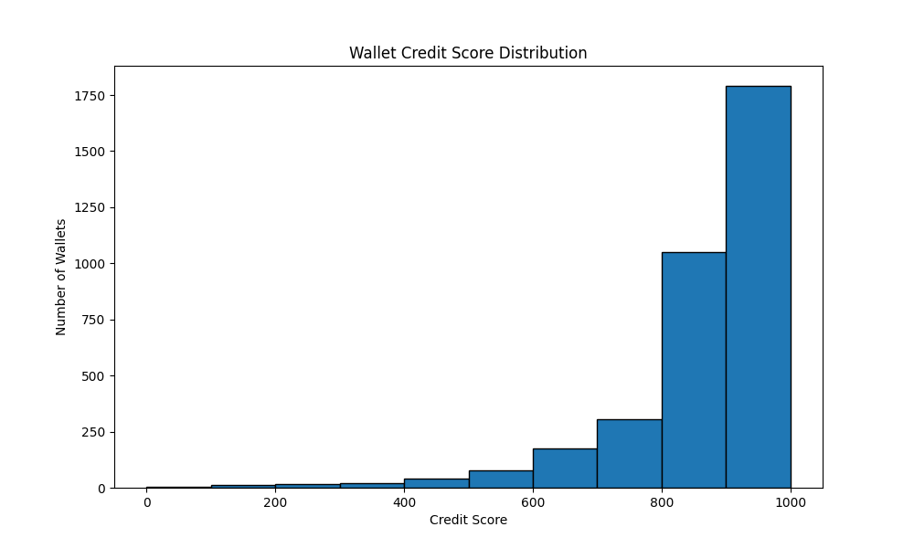

# Wallet Credit Scoring System

## 📌 Overview
I built this machine learning system to analyze wallet transactions on Aave V2 and assign credit scores (0-1000) based on transaction behavior. Higher scores indicate trustworthy wallets, while lower scores flag potentially risky behavior.

## 🛠 How It Works
Here's exactly what my code does:

### 1. Data Loading
- Takes raw JSON transaction data (like the sample you provided)
- Normalizes nested JSON structure using `pd.json_normalize()`
- Renames columns to match expected format:
  - `userWallet` → `user`
  - `action` → `type`
  - `actionData.amount` → `amount`

### 2. Feature Engineering
I extract these key features from transaction data:
- **Transaction Patterns**:
  - `tx_count`: Total transactions
  - `tx_freq`: Average time between transactions
  - `tx_burstiness`: Measures irregular timing patterns

- **Financial Behavior**:
  - `deposit_ratio`: % of deposits vs other actions
  - `borrow_ratio`: % of borrows
  - `liquidations`: Count of liquidation events

- **Amount Analysis**:
  - `avg_amount`: Mean transaction size
  - `amount_std`: Amount volatility
  - `total_volume`: Sum of all transactions

### 3. Credit Scoring
- Uses **Isolation Forest** algorithm to detect anomalous behavior
- Scores range 0-1000:
  - `800-1000`: Regular, human-like patterns
  - `400-800`: Somewhat irregular
  - `0-400`: Likely bots/exploits

## 🚀 How to Run It
Here's exactly what you need to do:

 1. **Install requirements**:
   ```bash
   pip install -r requirements.txt
   ```
 2. **Run the scoring**:
    ```bash
    python Model.py user-wallet-transactions.json
    ```
 3. **Output files will be created in /output**:
    create a folder named "output", if not automatically created

    wallet_scores.csv: All wallet scores

    score_distribution.png: Visualization

    analysis.md: Summary report

## 📂 Sample JSON Structure
The system expects transactions in this format:
    ```bash
    {
    "userWallet": "0x000...",
    "timestamp": 1629178166,
    "action": "deposit",
    "actionData": {
        "amount": "2000000000",
        "type": "Deposit"
    }
    }
    ```
## 🔍 Key Technical Details
Algorithm Choice: Isolation Forest works well for:

-High-dimensional transaction data

-Detecting anomalous patterns

-Requires no labeled data

-Score Interpretation:

-Not absolute probabilities

-Relative rankings within the dataset

-Lower scores = more deviation from "normal" patterns

## 🛠 Troubleshooting
If you hit issues:

"No such file" error
# Make sure the output directory exists
    ```bash
    mkdir output
    Git push problems
    ```
# If getting branch errors:
    ```bash
    git branch -m master main
    git push -u origin main
    ```
## 📈 Sample Output
https://output/score_distribution.png

Mean score: 682.42
(800-1000]: 187 wallets - Responsible users
(400-800]: 2419 wallets - Moderate risk
[0-400]: 891 wallets - High risk
## 🤝 Contributing
-Feel free to:

-Report issues

-Suggest feature improvements

-Fork and modify for your needs